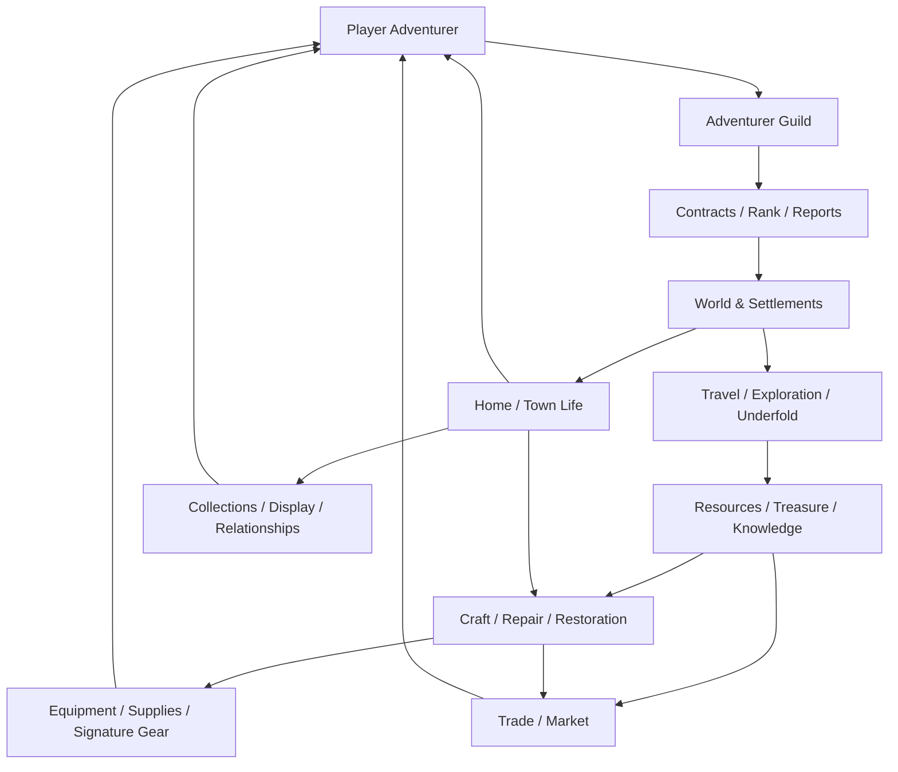

# World & System Integration Guardrails v0.1

**Date:** 2026-10-03  
**Status:** Repository-wide design governance; applies to all working proposals  
**Authority:** Interprets new work through canonical Bible v0.2.1 and the owner direction that all systems must belong to one coherent game world.

## Active consolidation reference

For conflicts discovered across the current specialist documents, use `design/CONSOLIDATION-AUDIT-2026-10-03.md`. The audit resolves terminology and stale planning references without promoting working proposals into canon.

---

## Purpose

The repository now contains enough systems that the main design risk is no longer "missing features."

The risk is **feature drift**: adding individually interesting mechanics that no longer feel like one Adventurer Life RPG.

From this checkpoint onward:

> **No new system is accepted merely because it is fun in isolation. It must strengthen the same world, same player fantasy, same progression language and same production direction.**

---

# 1. Source-of-truth hierarchy

When documents disagree, use this order:

1. **Owner-approved locked principles**
2. **Game Concept Bible v0.2.1**
3. **Earlier Bible material not superseded by v0.2.1**
4. **Decision Register**
5. **Specialist system documents**
6. **Authored catalogues/content examples**
7. **Research/reference studies**

Research never silently becomes lore.

A large catalogue never overrules the Bible.

A specialist document cannot invent a new progression ladder that contradicts the shared game.

---

# 2. The one-game test

Every new mechanic must answer all seven questions.

1. **Where does it exist?**  
   Which settlement, institution, profession, region, dungeon or social space makes it believable?

2. **Who uses it?**  
   Player, Guild, craftsperson, settlement, party, faction or specific NPC role?

3. **Why does an adventurer care?**  
   Preparation, survival, exploration, mastery, livelihood, relationship, discovery or legacy?

4. **Which existing system does it connect to?**  
   Guild, Rank, contracts, travel, Pattern Magic, crafting, economy, treasure, social play or world mystery?

5. **What existing term does it reuse?**  
   Do not create a second name for an existing concept.

6. **What happens if it is removed?**  
   If removing it breaks nothing and changes no fantasy, it may be unnecessary feature creep.

7. **What is the smallest playable version?**  
   Design the vertical slice before the empire.

A proposed system that cannot answer these questions should remain research, not enter the main design.

---

# 3. Shared player fantasy

All major systems must reinforce:

> **Live the life of an adventurer, start from nothing, earn your name, and discover a world that changes with you.**

Examples:

- Combat = surviving and solving dangerous work.
- Crafting = preparing adventurers and building a professional identity.
- Trade = adventurers and towns depending on one another.
- Housing = having a place in the world after living on Guild/inn beds.
- Treasure = discovering history and new possibilities.
- Social systems = neighbors, party members, customers, mentors and fellow professionals.
- Endgame = legacy, mastery and unknown-world exploration.

No system should quietly turn the project into:
- kingdom management;
- factory automation;
- land speculation;
- idle tycoon;
- full-loot PvP survival;
- chosen-one power fantasy;
- autonomous NPC MMO.

---

# 4. Shared terminology dictionary

## Guild Rank
F -> E -> D -> C -> B -> A -> S.

Meaning: professional trust and contract eligibility.

Not:
- character level;
- gear score;
- wealth tier;
- social caste.

No SS/SSS by default.

## Character mastery
Weapon, Discipline, Learned Skills, Pattern Magic and Life Skills.

Meaning: what the player can do.

Separate from Guild Rank.

## Merit / professional evidence
Evidence used for Guild trust/promotion.

Not tradeable money.

## Local standing
How a settlement/community currently regards the player.

Contextual and evidence-based.

Not a universal morality score.

## Artisan reputation
Recognition for reliable craft/service.

Not Guild Rank.

## Coin
Copper/Silver/Gold ordinary money.

Do not add new normal coin tiers without a real economic need.

## Functional magical resource
Possible future category for resources that are both useful and tradeable.

It is **not automatically a second universal currency**.

Any working name such as Pattern Shard remains non-canonical until approved.

## Drift
Ambient magical energy used by bounded Pattern Magic.

It is not mana created from nothing.

## Pattern Magic
Bounded, material-aware magical practice.

Families currently include Heat Exchange, Impulse, Sensing, Binding and Vital Care.

## Relic
Object significant because of history/function/world connection.

Relic is not a universal combat rarity tier.

## Signature Gear
Equipment that gains owner relationship/history.

Signature != Relic.

## Hidden Realm
Clue-driven bounded secret/rare adventure space with an in-world reason to exist.

Not a random portal content bucket.

---

# 5. World anchors

New content should normally attach to an existing anchor before inventing another region.

## Ternhaven
Starter city:
- Adventurer Guild;
- market;
- inn;
- clinic;
- training;
- archive;
- Underfold gate;
- salvage/repair economy.

Use Ternhaven first for:
- housing prototype;
- commissions;
- workshops;
- player social space;
- early market;
- collection display.

## Aldermead
Food/agriculture/irrigation/local trust.

Use for:
- farming knowledge;
- food supply;
- small garden traditions;
- rural contracts.

Do not build a separate farming-management game.

## Fenwick
River/ferry/fish/salvage/flood.

Use for:
- fishing;
- river trade;
- preservation;
- transport.

## Highmere
Herbs/wool/weather/route knowledge.

Use for:
- apothecary materials;
- textile craft;
- weather preparation.

## Bellcross
Ore/caravan/smithing.

Use for:
- metalwork;
- repair;
- equipment commissions.

## Underfold
Main long-term mystery and expedition destination.

Do not make every subsystem originate from the Underfold.

Surface life must remain independently meaningful.

---

# 6. Institution ownership

Use existing institutions before inventing new global organizations.

## Adventurer Guild
Owns:
- licensing;
- ranked contracts;
- professional evidence;
- rescue coordination;
- maps/reports;
- expedition registration;
- escrow/mediation;
- some requisitions.

Does NOT own:
- every shop;
- all housing;
- all religion;
- all crafting;
- criminal law.

## Settlements / local authorities
Own:
- property/leases;
- local market rules;
- civic works;
- guards/law;
- local permits.

## Hearth Covenant
Existing civic/religious institution for:
- clinics;
- public kitchens;
- burial rites;
- stewardship/witness traditions.

Do not turn it into a universal magic church without later approval.

## Craftspeople / merchant networks
Own:
- workshops;
- commissions;
- specialized services;
- regional trade.

---

# 7. System connection map

The loop must remain centered on the player's life as an adventurer.

Housing, market and craft support the loop; they do not replace the entire game with passive management.

---

# 8. Hard coherence guardrails

Do not introduce without explicit owner review:

- new Guild ranks above S;
- a second character-level ladder that duplicates mastery;
- global gear score as the main progression language;
- +1 to +99 enhancement treadmill;
- random destruction of beloved gear;
- mandatory daily energy/focus;
- forced open-world PvP;
- full-loot death;
- player ownership of progression-critical world land;
- permanent monopoly over required resources;
- autonomous NPC adventurers consuming player contracts;
- instant global teleportation;
- industrial automated mass production;
- passive NPC shops generating major wealth while offline;
- chosen-one bloodline;
- copied xianxia cultivation realms or named artifacts/techniques.

---

# 9. Complexity budget

A new system should preferably reuse existing values.

Before inventing a new:
- currency;
- rank;
- reputation;
- rarity;
- quality;
- resource meter;
- progression bar;

prove that an existing concept cannot express the requirement.

Current shared concepts are already enough for most content:
- Guild Rank;
- mastery;
- professional evidence;
- local standing;
- artisan reputation;
- coin;
- material quality;
- workmanship;
- condition;
- provenance;
- relic significance.

---

# 10. Status labels

Every specialist document should use one of:

## Locked
Owner-approved principle.

## Working Proposal
Coherent direction allowed for design/prototyping but not final canon.

## Tuning Assumption
Numbers/values used for testing only.

## Research
External evidence/inspiration only.

## Authored Example
Concrete content demonstrating a system; names/details remain reviewable unless promoted.

Do not call a proposal "canon" merely because it exists in Git.

---

# 11. Current integration audit

## Strongly integrated
- Player-First Guild model
- F→S professional rank
- starter region
- bounded Pattern Magic
- first-ten-hours loop
- Underfold exploration
- economy baseline
- skills/mastery
- treasure/manual systems
- equipment/Signature Gear
- crafting/gathering

## Integrated but still proposal-heavy
- world-network Main Story
- Floor 100 junction direction
- post-S unknown world
- hidden realms
- curated rare-item auction
- Signature Gear thresholds

## Must remain explicitly open
- exact combat model
- final classes
- death policy
- world name Oravel
- final networking architecture
- final commercial model
- functional magical-resource naming/role
- housing ownership model beyond prototype
- pets/mounts
- permanent large-scale farming
- player-run shop automation

---

# 12. Housing integration boundary

Housing belongs to the world only if it supports:
- rest/home identity;
- collection/display;
- storage;
- social visits;
- small craft workspace;
- limited gardening/decoration;
- local relationships.

Housing does NOT initially include:
- land empire;
- rent speculation;
- passive factory;
- NPC labor workforce;
- essential stat buffs;
- progression-critical land scarcity.

Prototype housing starts in **Ternhaven**, not as a universal continent-wide property system.

---

# 13. Future document rule

Before adding another major system, update this integration map and Decision Register.

The default question is no longer:

> "What else can the game have?"

It is:

> **"What does the existing Adventurer Life need next, and where does it live in the world we already built?"**
