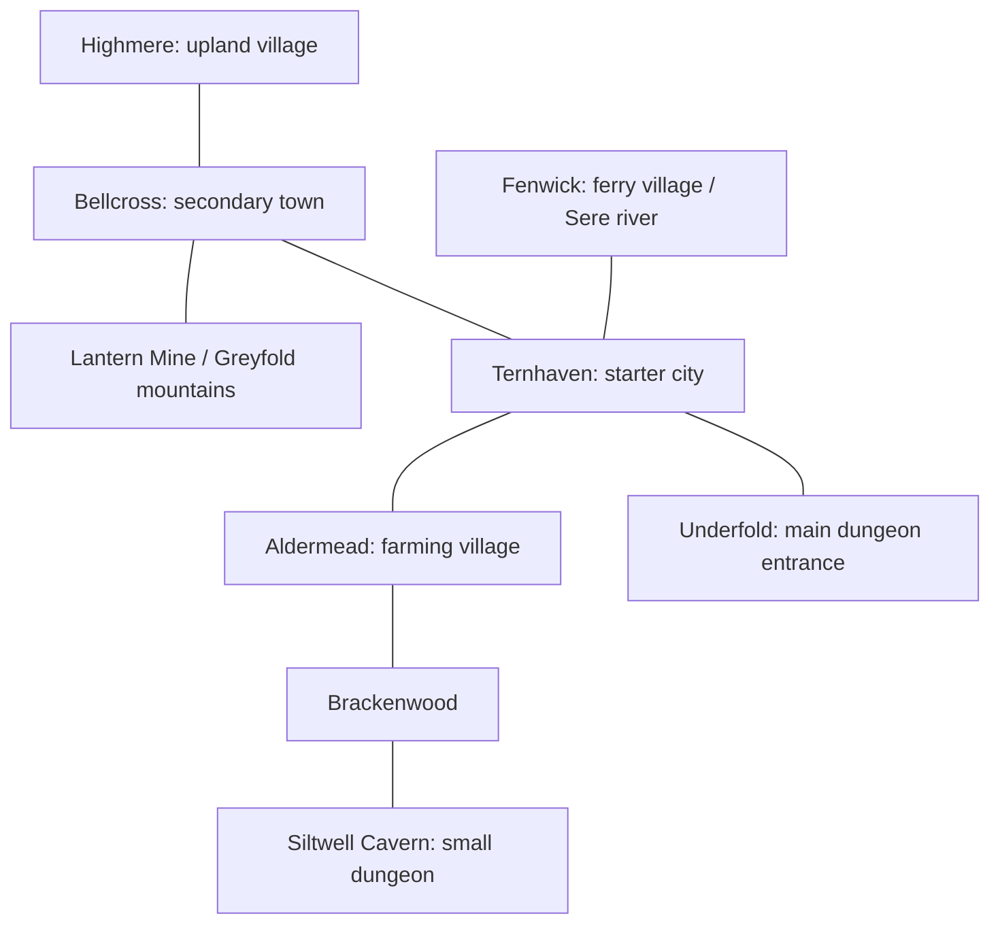

# The Reedmark — starter region

**Status:** Working geography and travel targets. Full-region description exceeds playable slice scope.

## Route graph

This graph gives connectivity, not geographic scale. Greyfold runoff flows south through Bellcross toward Ternhaven and Fenwick; Aldermead's irrigation branches from the Sere. Brackenwood lies east of the fields. Main-dungeon drainage emerges near the river, providing clues rather than a convenient universal sewer.

## Settlement functions

| Location | Economy and dependency | Player services and play | State change |
|---|---|---|---|
| Ternhaven, starter city | Mills, storage, repair, licensed salvage; requires village grain and northern ore | Guild, market, inn, clinic, training, archive, dungeon gate | Scarcity changes displayed supplies; returning NPCs bring news |
| Aldermead, village 1 | Grain, vegetables, livestock; depends on canal maintenance and safe road | Five early contracts, inexpensive meals, lost-animal search, first social consequence | Restored culvert preserves harvest; late help costs yield but does not erase village |
| Fenwick, village 2 | Ferry tolls, reed mats, fish, river salvage; needs stable crossings | Escort choices, storm rescue, contraband witnesses | Flood switches ferry to relief service; traders reroute |
| Highmere, village 3 | Medicinal leaves, wool, weather observation; needs imported grain and tools | Cold preparation, apprentice-herbalist conflict, route mapping | Early warning changes downstream job information |
| Bellcross, secondary town | Ore weighing, caravan staging, smithing charcoal; depends on mine safety | Future E/D escorts, branch office, metal price comparison | Mine closure reduces stock instead of spawning infinite ore |

Working populations are intentionally unspecified: background density should follow art and simulation budgets, not invented census precision. Buildings imply an economy beyond the player; not every home needs an enterable interior.

## Landmarks and resource logic

**Brackenwood:** mixed woodland, wet hollows and old charcoal paths. Fallen timber supports charcoal, fungi feed scavengers, and clearing animals drive predators toward farms. Useful herbs grow in safe edge clearings; deeper medicinal roots need better equipment and knowledge. Gathering removes local stock until a rest tick; avoid instant infinite harvest loops.

**Greyfold mountains:** watershed, steep weather changes and ore seams. A path may be legal for an F courier but unsafe during a storm. Dangerous places should show physical warnings and reports, not a rank-number force field.

**Sere river:** freight is cheaper than carting heavy ore, but floods delay medicine and food. Water wheels anchor Ternhaven's mills. Clearing an irrigation channel differs from draining a whole river; beginner magic cannot solve both.

**Lantern Mine:** active iron operation with a disputed abandoned ventilation gallery. Workers, not dungeon monsters, make most ore. Early reports concern airflow and missing tools; deep investigation comes later. The mine is a workplace with access permits, shifts and evacuation rules.

**Siltwell Cavern:** former storage cavity breached by water; a small independent dungeon that tests light, surveying and retreat. Reed-eating beetles, scavenger gels and one displaced den explain threats. A blocked spillway links habitat disturbance to the farms. It is not counted as Underfold floor 1.

**Underfold entrance:** supervised gate on Ternhaven's stone shelf. The gatehouse records routes, expected return and emergency contacts. F permits cover floor 1's marked inspection loop; deeper approved E expeditions need the one-rank-above conditions until promotion. A gate warning distinguishes legal access from the player's actual readiness.

## Travel targets

| Route | Fictional walking estimate | Prototype traversal target | Risk / trade purpose |
|---|---|---|---|
| Ternhaven–Aldermead | About 1 hour | 4–6 minutes first trip | Food carts; route clue and shelter |
| Aldermead–Brackenwood edge | About 30 minutes | 2–3 minutes | Charcoal/herbs; predator signs |
| Wood edge–Siltwell | About 30 minutes | 2–3 minutes | Spore pockets, displaced animals |
| Guild–Underfold gate | About 10 minutes | 1–2 minutes | Porters and salvage queue |
| Ternhaven–Fenwick | About half a day | Map-only in slice | Grain boats, flood closure |
| Ternhaven–Bellcross | About one day | Map-only in slice | Ore road and caravans |
| Bellcross–Highmere | About half a day | Map-only in slice | Medicine and wool |

Fictional travel and wall-clock play are not identical. World time advances at explicit travel/rest/action boundaries in the slice; standing idle or reading dialogue does not secretly advance contracts. Keep useful shelter, distinct silhouettes and return shortcuts on playable routes. No empty 20-minute walk solely to express distance.

## Authored uncertainty and surface consequence

Initial culvert report is Reliable, but water damage may reveal an Incomplete side route. The player can bring a soil sample, ask a local, or retreat. A warning appears before a larger predator area. Once verified, the board updates and independently available adventurers can take the resulting inspection job.

The region has two slice event chains: canal obstruction and displaced cave animals. Both use finite authored states. Ignoring one may change a price or route, not destroy every future opportunity. Floods, nationwide war and procedural country simulation remain future design space.

## First-stratum identity without building ten floors

Retain v0.1's Beginner Depths ecology and the later ten-strata outline. In the slice:

| Floor | Economy / habitat | Challenge | Distinct reveal |
|---|---|---|---|
| 1 — Drain galleries | Mineral seepage, gels consuming organic runoff, surveyed salvage | Mark a return route, identify unstable footing | A manufactured pressure plate predates current Guild maps |
| 2 — Root pockets | Roots and insects near surface cracks, predators following prey | Track displaced animals; choose safe supply cache | Moisture change matches the canal disturbance |
| 3 — Broken weir | Old basin, abandoned maintenance alcove, valuable but heavy salvage | Bounded setpiece against a territorial nest guardian; optional disengagement | Evidence that opening one passage redirects water elsewhere |

Floor 3 is an early expedition objective, not the mandatory tenth-floor major boss. The maintenance alcove is a temporary rest point, not a permanent settlement. Main floor 4 is physically blocked in the slice; no production asset is required beyond it. Do not change the remaining strata or decide floor 100 here.
